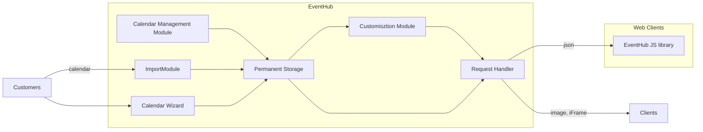
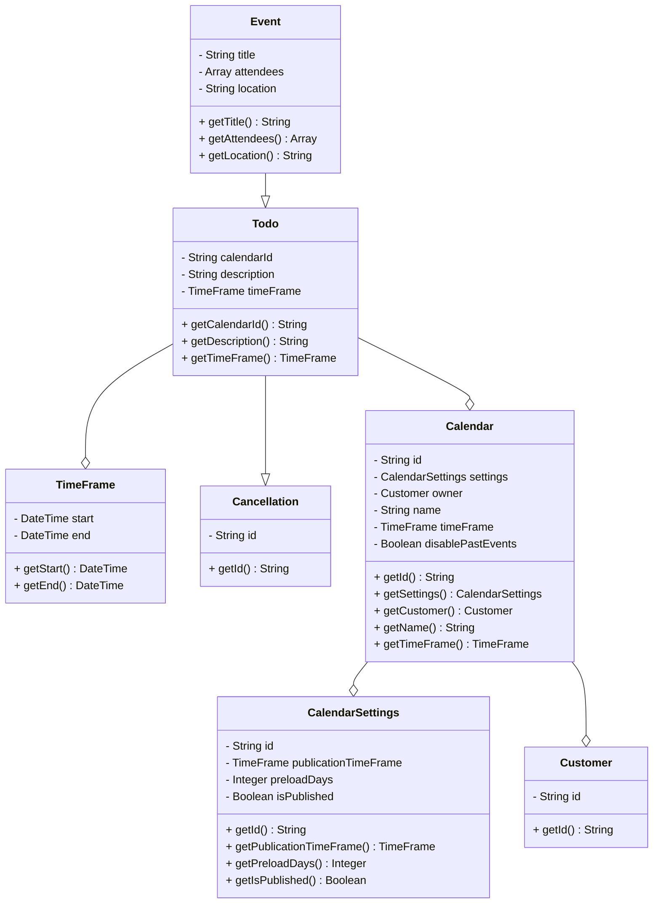
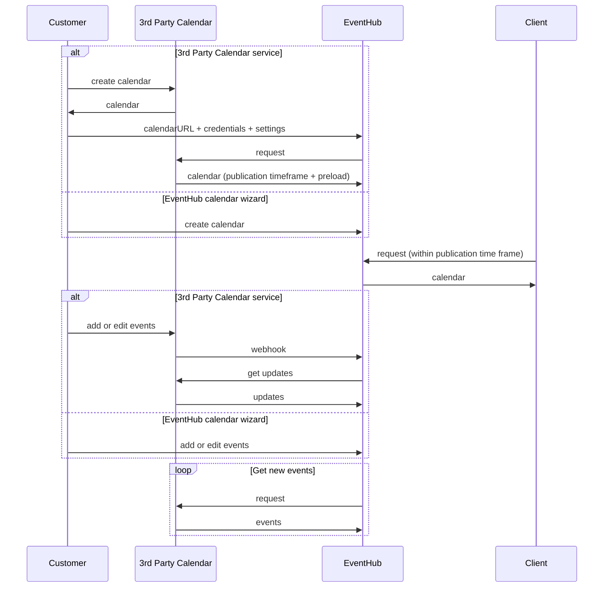
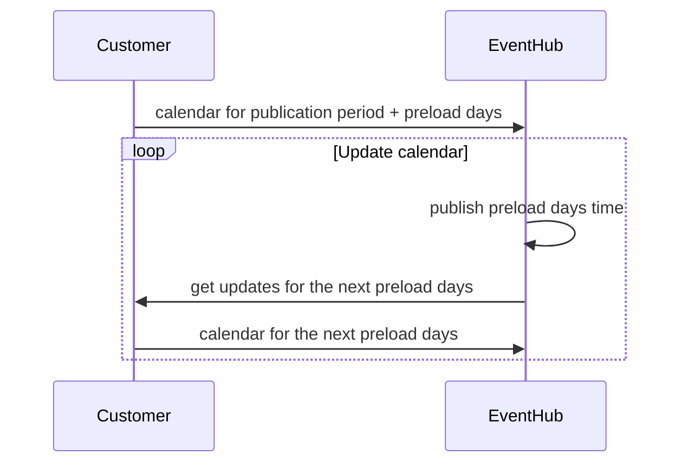
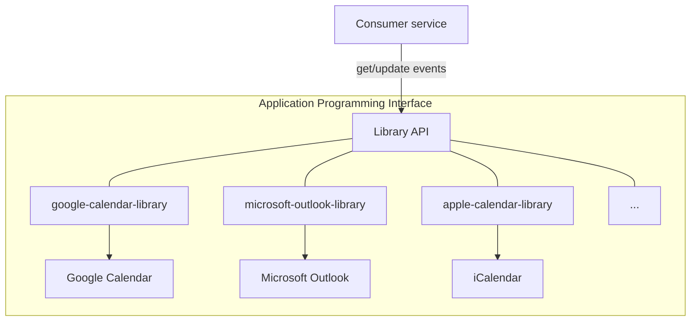
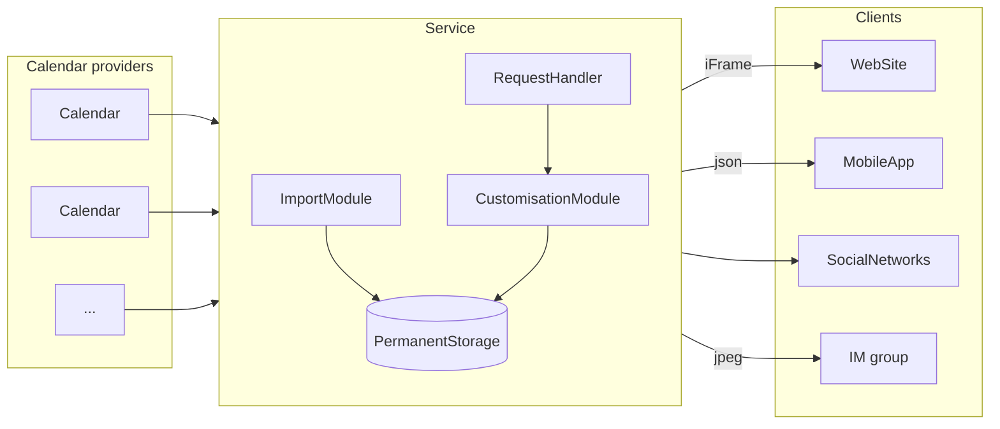
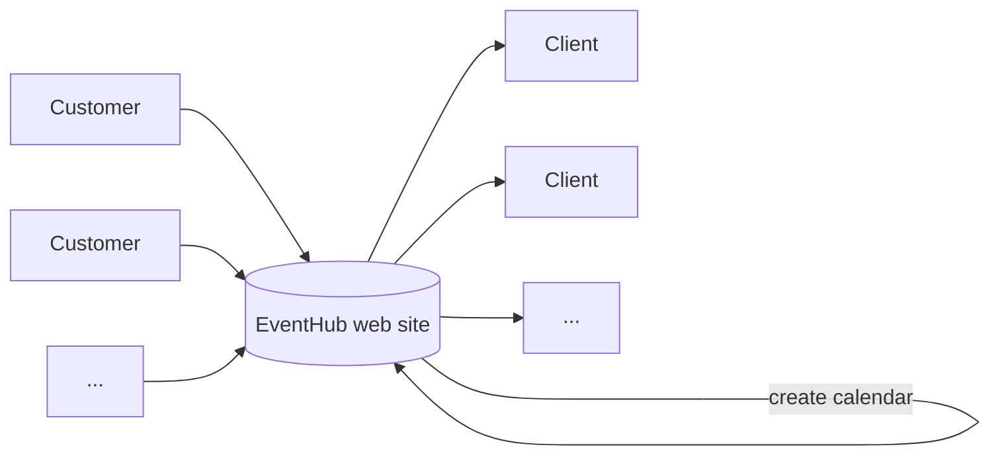

# EventHub

> If you want to add a video clip on your web site you don't usually want to create your own video hosting. Just upload the video on [YouTube](youtube.com) and *integrate it*. If you want to add a form/questionnaire just use [Google Forms](https://www.google.com/forms/about/) and *integrate it*. If you want to add a map just create whatever you want on [Google Maps](maps.google.com) and *integrate it*. If you want to add ad just *integrate* an ad network of your choice.
>
> Why this approach can't be applied to calendars?!

Many institutions have their *Calendars* which the *Clients* are interested in. Swimming pools, libraries, theatres, schools, etc. People want to have them in order to be aware and manage their own time.

Yes, most institutions have a web site or, at least, a social network account. In the best case they provide *Calendar* as a pretty document which you can download and print out. In the worst case it is just a text announcement.

The keyword here is "pretty". There isn't design which everybody likes. Also, if you follow a few schedules you, probably, would like them to be similar. Same font, same colors, same layout, same size, etc.

On the other hand, business owners want to focus on their business and not waste time on side questions.

This is why you want to use EventHub!

## Table of content
- [System overview](#system-overview)
- [Features](#features)
    - [Common features](#common-features)
    - [For Customers](#for-customers)
    - [For Clients](#for-clients)
- [Import Module](#import-module)
- [Calendar Wizard](#calendar-wizard)
- [Calendar Management Module](#calendar-management-module)
- [Customisation Module](#customisation-module)
- [Domain models](#domain-models)
- [Client side JS library](#client-side-js-library)
- [Workflow](#workflow)
- [Get updates](#get-updates)
- [API specification](#api-specification)
- [Implementation milestones](#implementation-milestones)
    - [3rd party calendar API libraries](#3rd-party-calendar-api-libraries)
    - [Backend service that exposes API to request schedules](#backend-service-that-exposes-api-to-request-schedules)
        - [Functional requirements](#functional-requirements)
        - [The service components](#the-service-components)
    - [Web site that provides a handy way to build calendars](#web-site-that-provides-a-handy-way-to-build-calendars)
- [Competitors](#competitors)
- [Terminology](#terminology)

## System overview



## Features
EventHub serves for both businesses and customers. This is cloud-based, easy to use service that provides handy way to deal with *Calendars*.

### Common features

Features that can be used buy both *Customers* and *Clients*

* wide printing capabilities
* multiple calendars
* view and print combined calendars
* historical data

### For Customers
Business can open an account and use powerful Calendar Wizard to create as much different calendars as they want for any time period. Once a calendar is created you don't have to duplicate it anywere due to wide integration possibilities.

* Calendar Wizard
* visibility (private, public) (?)
* integration (web sites, social netrowks, internet messagers, mobile apps, rss)
* veriety integration ways (iframe, js library, json, jpeg, svg, etc)
* notifications (about to get run out of schedule events for upcoming period)
* calendar publication
* open hours (?)
* style collection and customization

### For Clients
A single place where you can find all institutions schedules styled the way your choose. Customers are able to choose among available time period and subscribe on updates. Wide printing capabilities.

* a single place for all schedules
* search institutions
* choose uniform layout and style
* subscription (maitenance, changes, etc)
* add custom notes to any schedule
* export events to popular calendars (Outlook, Google Calendar, Apple iCal, etc)

## Import Module
A module that is responsible for loading Calendars from a calendar provider.

### Functional requirements

* Authenticate on a provider side
* Get list of events and updates
* Transform events into our Domain Models
* Support text formatting (MarkDown)

## Calendar Wizard

Powerful UI to create new and edit existing calendars. Rich text format capabilities.

## Calendar Management Module

A system module that is responsible for updating calendars properties. With this module you can define default styles, publish calendar, update time frames, etc.

## Customisation Module

A module that is responsible for applying styles to calendars and form different layouts from Permanent Storage data. Returns result in one of folloving formats: json, image, iframe.

## Domain models



## Client Side JS Library

This library is able to request any calendar data from *eventHub* server and build [DOM](https://developer.mozilla.org/en-US/docs/Web/API/Document_Object_Model/Introduction) out of it. Supports variety of layouts and provides a bunch of events to build logic on top of the rendered calendar.

## Workflow



## Get updates



## API specification

[link](openapi.yaml)

## Implementation milestones

The whole implementation process might be splitted out into three main milestones

### 3rd party calendar API libraries

A number of libraries which are able to extract events from a variety of calendars. The libraries incapsulate events pulling and smart updating processes. Support such event sources as ICS files, shared calendars, private calendars and other with different authentication mechanisms. Extract events for a given time frame. Once the events are pulled you can request updates only without pulling all data again.

Google calendar [library](https://github.com/np25071984/google-calendar-api-client)



### Backend service that exposes calendar API

At this point there isn't any web UI. It is just a backend service with permanent storage and you can interact with it via CLI, the storage or the public endpoint. The endpoint returns the calendars data.



#### Functional requirements

1. Add calendar - to add one of supported calendar providers into the system
2. Load events (time frame) - load events from an added calendar for a given time frame
3. Publish calendar - make the calendar available via API
4. Change calendar properties
    * publication time frame - which time frame is publicly available for the calendar
    * autoload option
    * notify when we are about to run out of events
5. Set default layout and style - there are many styles available to chose from and you can pick default. On the clients side, clients may override this value and get all calendars in their favorite style.
6. Return calendar data via API

### Web site that provides a handy way to build calendars

At this point we provide web based UI that may be used to create and customize calendars, set up permissions, see previews, etc. Clients will get a dashboard with their subscriptions.

* powerful calendar builder
* search possibilities



## Competitors

[Orchestra by QuickSchools](https://orchestra.quickschools.com/)

[Trumba](https://www.trumba.com/connect/default.aspx)

## Terminology

* calendar (timetable) - a collection of events
    * calendar time period - minimum time range (daily/weekly/monthly/yearly) which can be repeated over and over again (with or without changes) in order to build infinit schedule. If it is set the schedule may be extended automatically (you are alway able to make changes in any period). Otherwise it has to be filled manually in advance.
    * publiclly available periods amount - number of *calendar time periods* that *client* may navigate over
    * when to load a new portion of events
    * type - defines whether the institution available during working hours or not when there isn't any event on the date (open/close)
* event - a record which belongs to a schedule and describes planned happening. There are some types of events:
    * event type - defined in a certain time frame happening which has attendees, location and other properties
    * task type - a full day event
* customer - a calendar owner
* client - a calendar user

### Use cases

A number of real world examples

<details>
<summary>Swimming pool</summary>

https://www.sevenhillsohio.org/aquatics

The open hours: Tue - Sun, from 5:30 to 21:00. Monday closed.

The institution has many schedules:

#### the pool schedule
```
Sun: 12:00 - 17:45 Private Swim (2 or 3 lanes open)
Mon: 8:00 - 8:45 Deep water HIIT class
    9:00 - 9:45 Low Impact
    10:00 - 10:45 Arthritis Foundation
    16:45 - 19:00 The Entire Pool is Closed for Lessons and Swim Team. Sauna & Hot Tub are open
Tue: 8:15 - 8:45 HIIT Class
    9:00 - 9:45 Cardio & Toning
    10:00 - 10:45 SilverSplash
Wed: 9:00 - 9:45 Low Impact
    10:00 - 10:45 Arthritis Foundation
    16:00 - 17:00 Rec2Connect Swim Team (2 or 3 Lap Lanes Open)
    16:45 - 19:00 The Entire Pool is Closed for Lessons and Swim Team. Sauna & Hot Tub are open
    19:00 - 20:00 Rec2Connect Swim Team (2 or 3 Lap Lanes Open)
Thu: 8:00 - 8:45 Deep water HIIT class
    9:00 - 9:45 Cardio & Toning
    10:00 - 10:45 SilverSplash
    12:00 - 13:00 Rec2Connect Swim Team (1 Lap Lanes Open)
    18:00 - 19:00 Cardio & Toning
```

#### swim teacher Alisa

```
Mon: 8:00 - 9:00 ClassA
    12:00 - 12:00 ClassB
Thu: 8:00 - 9:00 ClassA
    12:00 - 12:00 ClassB
```

#### swim teacher Robert

```
Wed: 8:00 - 9:00 ClassA
    12:00 - 12:00 ClassB
Fri: 9:00 - 10:00 ClassA
    13:00 - 14:00 ClassB
```
</details>

<details>
<summary>School</summary>

Eva's PreK class schedule

```
Mon: 9:00 - 13:00
Thu: 9:00 - 13:00
Wed: 9:00 - 13:00
```

</details>


<details>
<summary>Library</summary>

https://attend.cuyahogalibrary.org/events
</details>

<details>
<summary>Public square</summary>

https://www.clevelandpublicsquare.com/events-calendar
</details>

## Questions

1. Return events from the past.